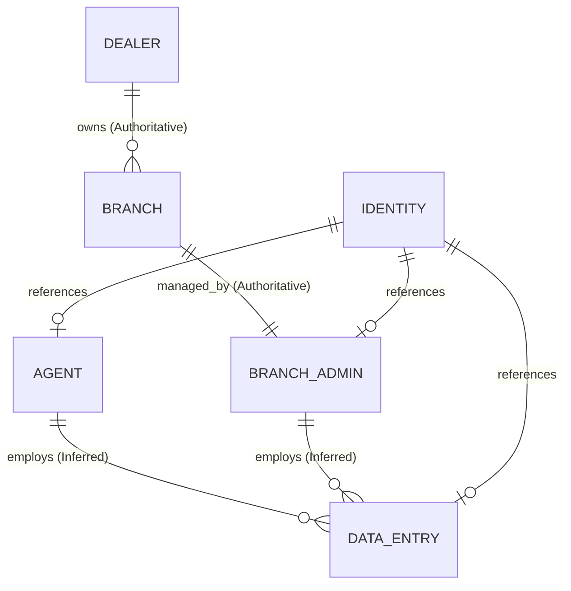
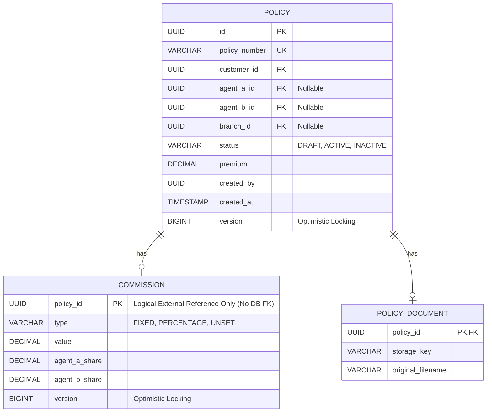

# Phase 5 Final Technical Design — Policy, Commission, Organization & Reporting

## SECTION 1 — CURRENT REPOSITORY BASELINE

### Repository State
- **Modules**:
  - `identity` (Existing): Owns user identity, basic RBAC, and authentication.
  - `platform` (Existing): Owns global API and security configurations.
- **Packages**:
  - `com.anverraglobal.identity`
  - `com.anverraglobal.platform.api`
  - `com.anverraglobal.platform.security`
- **Domain Models**: Currently only Identity models exist. Policy, Commission, Organization, and Reporting domain models are absent.
- **Persistence Patterns**: Spring Data JDBC with PostgreSQL.
- **Flyway Conventions**: 
  - *VERIFIED*: No database migrations currently exist in the repository baseline for Phase 5 modules.
  - *PROPOSAL/ASSUMPTION*: Standard `V{version}__{description}.sql` migrations will be introduced.
- **REST/API Conventions**: Standard Spring `@RestController` pattern.
- **Security Implementation**: Spring Security with JWT (in `platform.security`).
- **Frontend Architecture**: Vite + React + TypeScript (no state/form management libraries like TanStack Query or React Hook Form yet).
- **Eventing Infrastructure**: Spring Modulith application events (in-memory, synchronous or asynchronous).
- **Reporting Implementation**: None exists.
- **Storage/File Handling**: None exists.
- **Test Conventions**: JUnit 5, Spring Boot Test, Spring Modulith Test, ArchUnit.

### Phase 5 Strategy
- **Identity Module**: Reuse and Extend (retain authentication/RBAC, but do not add hierarchy).
- **Security Configuration**: Reuse.
- **Persistence (Spring Data JDBC)**: Reuse.
- **Spring Modulith Events**: Reuse.
- **Frontend Architecture**: Extend (TECHNICAL PROPOSAL: Introduce TanStack Query, React Hook Form, Zod).
- **Organization/Hierarchy Module**: Introduce new abstraction.
- **Policy Module**: Introduce new abstraction.
- **Commission Module**: Introduce new abstraction.
- **Reporting Module**: Introduce new abstraction.
- **Document Storage**: Introduce application-layer abstraction.

---

## SECTION 2 — MODULE ARCHITECTURE

### 1. Policy (`policy`)
- **Owned Domain Concepts**: Policy, Premium, Lifecycle Status, Document Reference, Policy-Customer relationship, Policy-Agent relationship.
- **Public Contracts**: `PolicyManagementApplicationService` (or similar interface for application use-case coordination), `PolicyEvent` publishers.
- **Allowed Dependencies**: None (document storage is an application/infrastructure capability within policy). (Consumes resolved `OrganizationScope` from the application layer).
- **Forbidden Dependencies**: `commission` (direct domain rules), `identity`, `organization` (Policy must not independently resolve hierarchy).
- **Application-Layer**: Orchestrate policy lifecycle.
- **Domain-Layer**: Manage policy invariants (0-2 agents, document limits, premium updates).
- **Persistence**: Manage `policies` and `policy_documents` tables.

### 2. Commission (`commission`)
- **Owned Domain Concepts**: Commission Rules, Allocations, Fixed vs Percentage logic, Limits (<= 50% premium).
- **Public Contracts**: `CommissionValidationService`, `CommissionCalculationService`, `CommissionManagementService` (for state updates).
- **Allowed Dependencies**: None (strictly isolated business logic).
- **Forbidden Dependencies**: `policy` (must not read policy tables directly).
- **Application-Layer**: Provide validation and calculation APIs for application use-cases.
- **Domain-Layer**: Execute business rules (UNSET semantics, allocation limits).
- **Persistence**: Manage `commissions` table.

### 3. Organization/Hierarchy (`organization`)
- **Owned Domain Concepts**: Dealer, Branch, relationships to Agents, Branch Admins, and Data Entry personnel.
- **Public Contracts**: `OrganizationScopeResolutionService`.
- **Allowed Dependencies**: `identity` (only for mapping `sub` to org nodes).
- **Forbidden Dependencies**: `policy`, `commission`, `reporting`.
- **Application-Layer**: Resolve user identity into an organizational scope constraint (e.g., list of allowed branch IDs).
- **Domain-Layer**: Parent/child relationship traversal.
- **Persistence**: Manage `dealers`, `branches`, `organization_memberships` tables.

### 4. Reporting (`reporting`)
- **Owned Domain Concepts**: Statistics, Analytics, Read Models for Policy and Commission data.
- **Public Contracts**: `StatisticsQueryApi`.
- **Allowed Dependencies**: None (consumes resolved authorization context via API parameters).
- **Forbidden Dependencies**: Direct reads of `policies` or `commissions` tables, `organization` (Reporting must not independently resolve hierarchy).
- **Application-Layer**: Listen to governed events from Policy/Commission, expose statistics APIs.
- **Domain-Layer**: N/A (Read-model focused).
- **Persistence**: Manage `reporting_read_models` tables.

### 5. Identity/Security (`identity`)
- **Owned Domain Concepts**: Authentication, JWT validation, basic RBAC roles.
- **Public Contracts**: `SecurityContext`.
- **Allowed Dependencies**: None.
- **Forbidden Dependencies**: `organization` (Identity must not own hierarchy).
- **Application/Domain-Layer**: Validate credentials, issue tokens, define basic roles.
- **Persistence**: Identity/User tables.

### 6. Document Storage (Infrastructure Capability)
*(Note: There is NO top-level `document` business module. The capability is owned by Policy.)*
- **Owned Domain Concepts**: Document metadata, 0..1 invariant.
- **Outbound Port**: `policy.port.outbound.DocumentStoragePort` (Provider-neutral).
- **Adapter**: `policy.adapter.outbound` (Cloudflare R2 implementation).
- **Persistence**: External Object Storage.

### 7. Policy/Commission Transaction Orchestration (Application Layer)
*(Note: There is NO top-level `orchestration` module. This is an application-layer concern.)*
- **Location**: Policy application layer (e.g., `PolicyManagementApplicationService`).
- **Allowed Dependencies**: Policy domain, Commission public contract.
- **Responsibilities**: Orchestrate the narrow cross-module transactional exception for Premium Update + Commission RESET → UNSET.

---

## SECTION 3 — ORGANIZATION / HIERARCHY DESIGN

### Authoritative Source
The `organization` module is the sole authoritative source for all organizational relationships. The Identity module provides the user identity, but Organization resolves the hierarchy.

### Entities and Relationships
- **Dealer → Branch**: 1 to Many (Authoritative).
- **Branch ↔ Branch Admin**: 1 to 1 (Authoritative). Each Branch has exactly one Branch Admin. A Branch Admin belongs to exactly one Branch.
- **Branch Admin as Agent A**: A Branch Admin may act as Agent A only for the Branch they administer.
- **Agent ↔ Branch**: No organizational membership relationship. Regular Agents are not branch-bound. Agent involvement in a Policy does not establish organizational branch membership.
- **Agent → Data Entry**: 1 to Many (Inferred).
- **Branch Admin → Data Entry**: 1 to Many (Inferred).

### Identifiers/Reference Relationships
- Organization entities will use immutable UUIDs or structured IDs.
- Identity (`user_id` or `sub`) will be referenced as an external ID within the Organization module, not as the primary key.

### Scope Resolution Model
- Given an Identity ID, the module traverses the hierarchy to produce an `OrganizationScope`. This is a conceptual contract capable of representing the full spectrum of authorized scopes:
  - Customer scope (e.g., `allowed_customer_ids`)
  - Agent scope (e.g., `allowed_agent_ids`)
  - Branch scope (e.g., `allowed_branch_ids`)
  - Dealer multi-branch scope (e.g., list of owned branches)
  - Data Entry inherited scope (exact duplicate of parent's constraints)
- Data Entry inherits the exact `OrganizationScope` of their parent.

### Conceptual Entity Model Diagram

---

## SECTION 4 — AUTHORIZATION DESIGN

### Authorization Flow
1. **Authentication**: JWT is validated by the `platform.security` layer.
2. **Identity/RBAC**: Security context establishes identity (`sub`) and basic role (e.g., `ROLE_AGENT`). JWT claims are NOT authoritative for hierarchy.
3. **Organization Scope Resolution**: The application queries the `organization` module to resolve the `sub` into an `OrganizationScope` (e.g., `allowed_branch_ids=[B1, B2]`).
4. **Authorization Context**: The resulting scope is cached in-memory (hybrid approach) for the duration of the request or a short TTL.
5. **Application Service**: The service layer passes the `OrganizationScope` down to the repository.
6. **Constrained Repository Query**: The repository appends the scope to the SQL `WHERE` clause, ensuring unauthorized records are filtered at the database level.

### Distinction of Concepts
- **Identity**: Who is the user? (e.g., standard `sub` claim from Identity Provider).
- **Role**: The systemic function of the user (e.g., Dealer, Agent, Customer).
- **Organization Hierarchy**: The raw tree of relationships defined in the Organization module (Dealer -> Branch -> Agent).
- **Resolved Scope (Authorization Context)**: The computed, conceptual authorization boundaries for a specific request. Distinguishes:
  - *Customer*: Scope limited to own customer_id.
  - *Agent*: Scope limited to involved policies (agent_id matches).
  - *Branch Admin*: Scope spans the entire branch (branch_id matches).
  - *Dealer*: Scope spans all owned branches (branch_id IN list of owned branches).
  - *Data Entry*: Inherits the exact scope of their parent (Agent or Branch Admin).
- **Resource Authorization**: The application layer validating if the Resolved Scope permits action X on resource Y.

---

## SECTION 5 — POLICY DOMAIN DESIGN

### Policy Aggregate
- **Policy Identity**: Internal UUID primary key.
- **Policy Number**: Immutable, globally unique business identifier (e.g., "POL-12345").
- **Creation Context**: Stores the `created_by` identity and timestamp.
- **Customer Relationship**: Mandatory external reference (`customer_id`).
- **Agent A / Agent B**: Nullable external references (`agent_a_id`, `agent_b_id`). Maximum of 2 agents. No Agent C.
- **Branch**: Nullable external reference (`branch_id`).
- **Premium**: Monetary value. Updates to this trigger Commission reset.
- **Lifecycle**: DRAFT -> ACTIVE -> INACTIVE.
- **Document Relationship**: 0..1 relationship. Progressive completion allows saving without a document initially.

### Invariants
- Customer-created policy can initially have zero agents.
- Regular Agent policy is not branch-bound (branch_id is null).
- Branch Admin policy is strictly branch-bound.
- Dealer policy requires selecting a specific Branch Admin (and thus a Branch).
- No physical deletion (soft delete or status change only).

### State Transitions & Commands
- `CreatePolicyCommand(draft data)`
- `UpdatePremiumCommand(new premium)`
- `ActivatePolicyCommand()` -> validates all mandatory fields exist based on business rules. (e.g., Premium). 
  - 0 Agents + UNSET = activation allowed
  - 1 Agent + UNSET = activation rejected
  - 2 Agents + UNSET = activation rejected
  - 1 Agent + ZERO = activation allowed
  - 2 Agents + ZERO = activation allowed
  - 1/2 Agents + valid positive Commission = activation allowed
  (Note: UNSET means Commission has not been configured. ZERO means Commission was explicitly configured as zero).

---

## SECTION 6 — COMMISSION DOMAIN DESIGN

### Commission Aggregate/Rules
- **Types**: FIXED or PERCENTAGE.
- **Limits**: Total Commission (Agent A + Agent B) must be <= 50% of the Policy Premium.
- **Agent Allocation**: Explicit split rules for Agent A and Agent B.
- **UNSET vs ZERO Semantics**: UNSET and ZERO are semantically different. UNSET means Commission has not been configured. ZERO means Commission was explicitly configured as zero. If a Policy Premium changes, the associated Commission state transitions to `UNSET`. 
- **Statistics Eligibility**: UNSET Commission -> excluded from Commission statistics. Explicit ZERO is a valid Commission and is included in Commission statistics as amount 0. Valid positive Commission -> included in Commission statistics regardless of DRAFT, ACTIVE, or INACTIVE Policy status.

### Boundary Enforcement
- Commission logic NEVER reads the Policy table.
- The Policy application layer passes the `premium` value into the Commission module for validation (`CommissionValidator.validate(commissionData, premium)`).

---

## SECTION 7 — POLICY ↔ COMMISSION TRANSACTION DESIGN

**APPROVED EXCEPTION (D01):** Narrow cross-module transaction for `Policy Premium Update + Commission RESET -> UNSET`.

### Technical Approach
1. **Transaction Owner**: The Policy application layer (e.g., `PolicyManagementApplicationService`) owns the transaction boundary. There is NO top-level orchestration module.
2. **Spring `@Transactional` Placement**: Applied to the application service method `updatePremium(...)`.
3. **Module Dependency Direction**: The Policy application layer depends on the public `CommissionManagementService` (in `commission`) via its public contract. Policy domain logic DOES NOT depend on `commission`.
4. **Execution Flow**:
   - `PolicyManagementApplicationService.updatePremium(policyId, newPremium)`
   - `CommissionManagementService.resetToUnset(policyId)`
   - Both succeed, transaction COMMITS.
5. **Rollback Behavior**: If either operation fails, Spring rolls back the entire transaction.
6. **Concurrency/Idempotency (RECOMMENDED IMPLEMENTATION MECHANISM)**: 
   - **Scenarios Protected**: Concurrent modifications to the same Policy (e.g., two users updating Premium simultaneously).
   - **Conflict Behavior**: Throws an `OptimisticLockingFailureException`, translating to a `409 Conflict`.
   - **Interaction with Transaction**: If the narrow Policy/Commission transaction fails due to optimistic locking on either aggregate, the entire transaction rolls back cleanly.
   - **Retry Implications**: Clients receiving a `409` must refetch the latest state and retry the operation.
7. **No Generalization**: This does NOT create a general pattern. Direct module-to-module calls (Policy -> Commission) remain forbidden. ArchUnit and Spring Modulith tests enforce that `policy` has no outbound dependency to `commission`.

---

## SECTION 8 — POLICY PERSISTENCE DESIGN

### Logical Schema

### Constraints Analysis
- **Cross-Module Persistence (Policy ↔ Commission)**: A physical database Foreign Key between `COMMISSION` and `POLICY` is NOT permitted to maintain Modulith decoupling. The relationship is strictly a logical reference enforced entirely by the application's transaction boundary and domain rules.
- **Business Invariants**: 0-2 agents (handled by `agent_a_id` and `agent_b_id` columns), 0..1 document (1-to-1 relation using `policy_id` as PK).
- **Database Integrity Constraints**: `policy_number` is UNIQUE. Foreign keys are enforced logically or physically depending on module boundaries (Policy to Customer may be logical if Customer is in Identity).
- **Application Validations**: Commission <= 50% premium is validated in code, not via DB CHECK constraint, as rules may evolve.

---

## SECTION 9 — REPORTING DESIGN

### Event Architecture
*(Note: The event-based Reporting direction is APPROVED. The specific event names, payloads, versioning, and order semantics below are PROPOSED concepts unless D05 baselines their exact definitions).*

1. **Source Events (PROPOSED)**: `PolicyActivatedEvent`, `PolicyPremiumUpdatedEvent`, `CommissionConfiguredEvent`.
2. **Event Ownership (PROPOSED)**: Defined and published by Policy/Commission modules.
3. **Payload (PROPOSED)**: Must contain fully resolved snapshots of the data (e.g., premium amount, branch_id, agent_ids) to prevent Reporting from needing to query back.
4. **Ordering/Idempotency (PROPOSED)**: Events include timestamps and version numbers. Consumers must handle idempotency.

### Read Models
- Reporting persists flattened read models optimized for aggregation (e.g., `reporting_policy_stats`, `reporting_commission_stats`).
- **Authorization Filtering**: The API/application layer resolves the `OrganizationScope` (via the Organization module) and passes this resolved authorization context into Reporting. Reporting does NOT independently resolve organizational scope; it solely applies the provided scope to the read-model queries (e.g., `WHERE branch_id IN (:allowedBranches)`).
- **Consistency**: Eventual consistency is acceptable for statistics. Stale data during high load is an accepted tradeoff for decoupling.

---

## SECTION 10 — API DESIGN

*(Note: The concrete API URIs listed below are TECHNICAL DESIGN PROPOSALS. Final URI/DTO/OpenAPI contracts remain governed by D04).*

### 1. Create Policy
- **Method/URI**: `POST /api/v1/policies`
- **Auth**: Customer, Agent, Branch Admin, Dealer, Data Entry.
- **Request**: `CreatePolicyRequest` (draft data).
- **Response**: `201 Created` with Policy ID.

### 2. Update Premium (Triggers Transaction)
- **Method/URI**: `PATCH /api/v1/policies/{id}/premium`
- **Request**: `UpdatePremiumRequest` (new premium amount).
- **Response**: `200 OK`. Resets commission to UNSET.

### 3. Configure Commission
- **Method/URI**: `PUT /api/v1/policies/{id}/commission`
- **Request**: `ConfigureCommissionRequest` (type, values).
- **Response**: `200 OK`.

### 4. Activate Policy
- **Method/URI**: `POST /api/v1/policies/{id}/activate`
- **Auth**: Scoped to owners/agents.
- **Response**: `200 OK` or `422 Unprocessable Entity` if incomplete (e.g., UNSET commission when a commission is required by business rules).

### 5. Get/List/Search
- **Method/URI**: `GET /api/v1/policies`, `GET /api/v1/policies/{id}`
- **Auth**: Returns only policies within the caller's `OrganizationScope`.
- **Response**: `200 OK`, `403 Forbidden` (for authenticated unauthorized direct access), or `404 Not Found` (if genuinely missing).

### Duplicate Policy Resolution
- Normal workflow: `GET /api/v1/policies?policyNumber={number}` returns `200 OK` if the user is authorized, allowing the frontend to resolve it.
- Exceptional: Two exact millisecond creations result in `409 Conflict`. `409` is NOT the standard UX workflow for duplicate discovery.
- Existence Concealment: Security-sensitive existence concealment follows the mechanism governed by D04/D06. `403 Forbidden` remains the required authenticated authorization response where applicable; do not invent a general "unauthorized = 404" rule.

---

## SECTION 11 — DOCUMENT STORAGE DESIGN

### Distinction of Ownership
- **Policy Ownership**: The Policy aggregate owns the Policy -> Document relationship, the document metadata (e.g., original filename, reference key), the 0..1 invariant enforcement, and the authorization to access the document. Document must NOT become a second Policy domain.
- **Document Capability**: Document storage is an application/infrastructure capability within Policy. It owns strictly the provider-neutral storage abstraction (`DocumentStoragePort`), upload/download/delete operations, and the Cloudflare R2 adapter. There is NO top-level `document` module.

### Architecture
- **Abstraction**: `DocumentStoragePort` interface defined in the Policy application outbound boundary (`policy.port.outbound`). Policy domain remains provider-agnostic. Do not expose provider-specific concepts in Policy domain models.
- **Provider Recommendation**: Cloudflare R2 (APPROVED implementation provider). AWS S3 is an alternative provider that can be substituted behind `DocumentStoragePort`, but R2 is the selected provider.
- **Workflow**:
  - **Upload/Download**: Backend generates a Presigned URL for temporary secure object-storage access. Client interacts directly with R2 (or S3). Do not route large document payloads unnecessarily through the JVM.
  - **Metadata**: Backend stores `storage_key` and associates it with `policy_id`.
- **0..1 Invariant**: Updating a document overwrites the existing `storage_key` reference.
- **Authorization**: Presigned URLs inherit the authorization context of the API request that generated them.

---

## SECTION 12 — FRONTEND TECHNICAL DESIGN

### Architecture
- **Framework**: React + Vite + TypeScript.
- **Server-State (IMPLEMENTATION RECOMMENDATION)**: **TanStack Query** for fetching Policy lists, caching statistics, and handling server-side pagination/filtering.
- **Form-State (IMPLEMENTATION RECOMMENDATION)**: **React Hook Form** for complex Policy Create/Edit forms to prevent re-render performance issues.
- **Validation (IMPLEMENTATION RECOMMENDATION)**: **Zod** for schema-first validation ensuring API contract alignment.
*(Note: These libraries are implementation options/recommendations only. The authoritative requirement is the UX behavior defined by REQ-DEC-008, not a specific library).*

### UX Components
- **Policy List**: Server-side paginated, filterable by status/branch (if authorized). Loading/error states managed by TanStack Query.
- **Policy Detail**: Authorization-aware rendering (e.g., read-only for Data Entry if configured).
- **Commission Configuration**: Dynamic UI updates based on Premium changes. Warning states for UNSET commissions.
- **Document UX**: Direct-to-object-storage upload progress bars.

---

## SECTION 13 — ERROR & RESPONSE MODEL

- **`400 Bad Request`**: Validation errors (Zod matching on frontend, `@Valid` on backend).
- **`401 Unauthorized`**: Unauthenticated access attempt.
- **`403 Forbidden`**: Authenticated unauthorized access or action (e.g., trying to access an existing Policy outside one's organizational scope).
- **`404 Not Found`**: Authorized resource genuinely missing.
- **`409 Conflict`**: Database unique constraint violations (race conditions), optimistic locking failures.
- **`422 Unprocessable Entity`**: Business logic violations (e.g., Commission > 50%, Activation with UNSET commission when required).
- **`502/504`**: Document storage provider failures.

*Note on Existence Disclosure*: Security-sensitive existence concealment follows the mechanism governed by D04/D06. `403 Forbidden` remains the required authenticated authorization response where applicable, without inventing a new 403/404 rule.

---

## SECTION 14 — TESTING STRATEGY

### Domain Testing
- Unit tests for Policy aggregate invariants (0-2 agents).
- Unit tests for Commission validation (<= 50% logic).

### Integration Testing
- `@SpringBootTest` verifying the `Policy Premium Update + Commission RESET` transaction rolls back on DB failure.
- ArchUnit tests enforcing Modulith dependency boundaries (e.g., Policy does not depend on Commission domain).

### Authorization Matrix Testing
- Parameterized integration tests verifying:
  - Customer sees only own.
  - Agent A sees involved, cannot see uninvolved.
  - Branch Admin sees branch, cannot see other branches.
  - Dealer sees owned branches.
  - Data Entry inherits parent correctly.

### Reporting Testing
- Event emission, ingestion, and read-model updates.
- Stale read-model verification (eventual consistency checks).
- Scope-aware aggregation (unauthorized data is excluded from sums).

### Document Testing
- Mocked object-storage adapter verifying Presigned URL generation.
- Lifecycle tests: replacing a document removes the old reference.

---

## SECTION 15 — TECHNICAL DECISIONS REQUIRED

### A. ALREADY APPROVED
- Narrow cross-module transactional exception for Premium Update + Commission Reset (D01).
- Organization module as authoritative hierarchy owner (D02).
- Reporting module owns statistics and read models (D03).

### B. REQUIRED TECHNICAL CONSEQUENCES
- Database queries MUST enforce `OrganizationScope` in `WHERE` clauses to prevent unauthorized data exposure.
- JWT must NOT be used as the authoritative source for organizational hierarchy.
- Policy/Commission domains must remain isolated despite the transactional exception.

### C. RECOMMENDED TECHNICAL DESIGN
- Hybrid Authorization Context: Dynamic org lookup cached in-memory per request/session.
- Application Service Orchestration: The Policy application layer orchestrates the narrow cross-module transaction exception.
- Frontend Stack: TanStack Query, React Hook Form, Zod.

### D. TECHNICAL DECISIONS STILL REQUIRING HUMAN APPROVAL
*(None in this phase. Cloudflare R2 is approved. Frontend libraries are treated as implementation recommendations, not architectural requirements).*

---

## SECTION 16 — IMPLEMENTATION BOUNDARY

The following assets will be created in future implementation phases (NOT IN THIS TASK):

- **Java Modules/Classes**:
  - `policy` module (Entities, Repositories, Services, Controllers).
  - `commission` module (Entities, Services).
  - `organization` module (Entities, Scope Resolution Services).
  - `reporting` module (Listeners, Read Models, Statistics APIs).
  - (Document Storage is implemented via an infrastructure adapter in Policy).
- **Database Migrations**:
  - Flyway scripts for `policies`, `commissions`, `dealers`, `branches`, `organization_memberships`, `reporting_read_models`.
- **Frontend Components**:
  - React components for Policy List, Detail, Forms, and Statistics.
  - TanStack Query hooks, Zod schemas.
- **Dependencies**:
  - AWS SDK (S3) or similar in `pom.xml`.
  - TanStack Query, React Hook Form, Zod in `package.json`.
